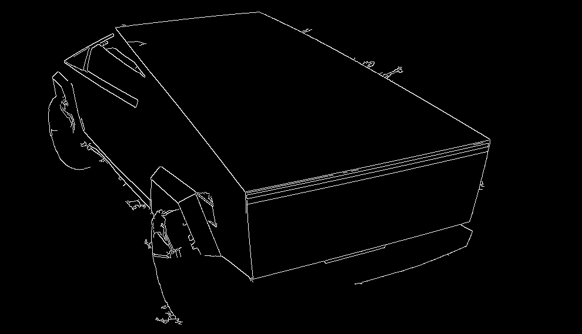
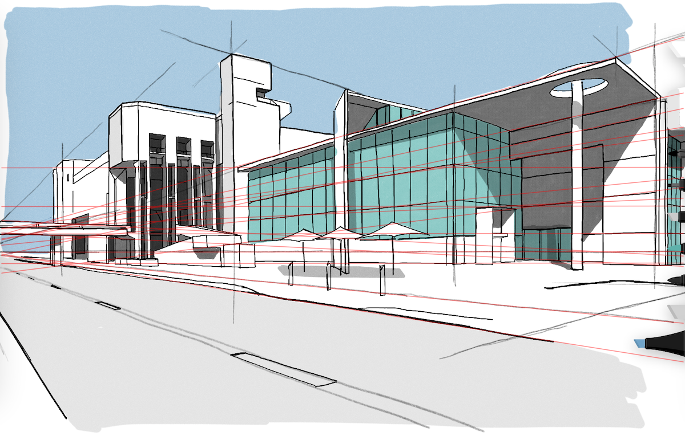

# Hough transform exploration

A [jupyter notebook](./data/Hough.ipynb) that implements the Hough transform from scratch, and allows exporting the Hough accumulator image.

For example, if we take the following input image:


We perform a gaussian blur and Canny edge detection to find the edges:



We run the Hough transform, and preview the accumulator:


We then threshold this and detect the peaks:


We can convert these points from rho/theta to cartesian line coordinates, and plot them on our input image:



---

### Development

You can run this up in a single command using my [python-opencv-notebook](https://github.com/alexlouden/python-opencv-notebook) docker image:

1. Run docker image

```bash
docker run --interactive --tty --init --rm --name opencv-notebook --publish 8888:8888 --volume `pwd`/data:/app/data alexlouden/python-opencv-notebook
```

2. Open localhost:8888 URL output by the previous command
